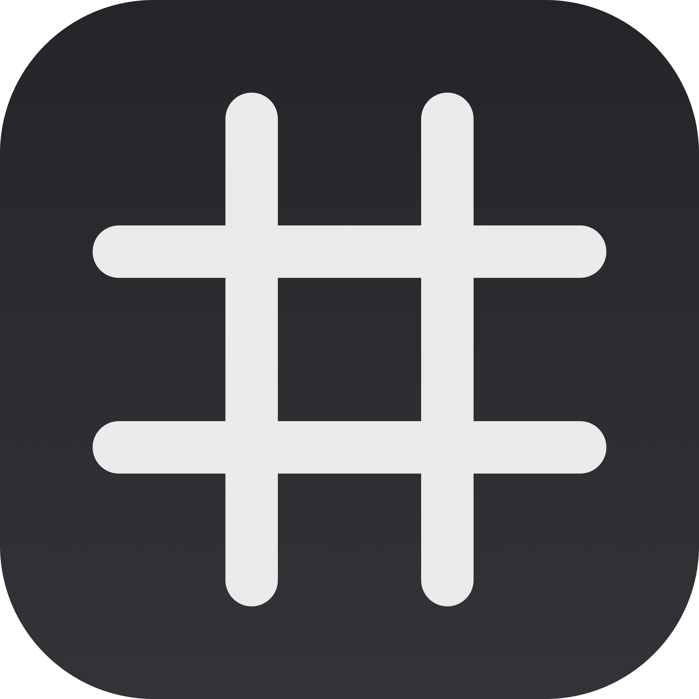
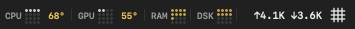
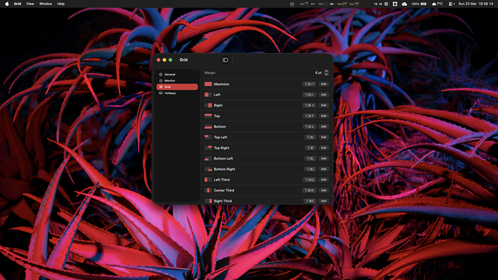
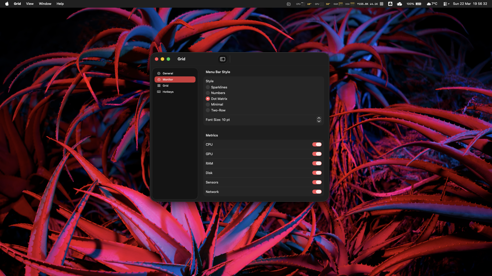

<p align="center">
  
</p>

<h1 align="center">Grid</h1>

<p align="center">
  <a href="https://github.com/pom11/Grid"></a>
  <a href="https://github.com/pom11/Grid"></a>
  <a href="https://github.com/pom11/Grid"></a>
  <a href="LICENSE"></a>
  <a href="https://github.com/pom11/homebrew-tap"></a>
</p>

<p align="center">
A keyboard-driven macOS menu bar app for window management and system monitoring.<br>
Snap windows to zones, cycle focus between windows, move windows across displays — all without touching the mouse.
</p>

<p align="center">
  
</p>

Built with Swift and SwiftUI. No Electron. No frameworks. Just a native menu bar app that stays out of your way.

## Screenshots

<p align="center">
  
</p>
<p align="center"><em>Grid tab — zone editor with 32x18 ultra-fine grid and drag-to-select</em></p>

<p align="center">
  
</p>
<p align="center"><em>Monitor tab — 5 menu bar styles, metric toggles, font size</em></p>

## Why

I wanted a single lightweight app to manage window layouts and keep an eye on system stats — without ever reaching for the mouse. Most window managers don't show system info. Most system monitors don't snap windows. And almost none of them let you cycle keyboard focus between windows.

Grid does all three from one menu bar icon. Define zones on a grid, assign hotkeys, and snap any window instantly. Cycle focus between windows with a keystroke — no clicking, no mouse, no alt-tab guessing. Move windows across displays without dragging. Meanwhile, CPU, GPU, RAM, disk, temperatures, and network speed sit right in the menu bar — no extra apps needed.

## Features

- **Keyboard-driven** — snap, focus, and move windows without touching the mouse
- **Window snapping** — snap any window to predefined zones with keyboard shortcuts
- **Keyboard focus** — cycle focus between windows with hotkeys, no mouse needed
- **Ultra-fine grid** — 32x18 grid for precise zone positioning
- **Zone editor** — drag-to-select zone boundaries with live preview
- **System monitor** — CPU, GPU, RAM, disk, network stats in the menu bar
- **Temperature sensors** — CPU and GPU temps displayed inline via SMC
- **5 menu bar styles** — Sparklines, Numbers, Dot Matrix, Minimal, Two-Row
- **Heat colors** — values change from white to yellow to orange to red based on load
- **Multi-display** — move windows between displays with hotkeys
- **Default layouts** — pre-configured zones for halves, quarters, thirds, and two-thirds
- **Configurable margins** — adjustable gaps between windows and screen edges
- **Launch at login** — native macOS login item support
- **JSON config** — all settings stored in `~/.config/grid/config.json`
- **Presets** (planned) — save and recall full window layouts with a single hotkey

## Default Shortcuts

### Zone Shortcuts

| Zone | Shortcut |
|------|----------|
| Maximize | ⌥⌘↩ |
| Left / Right | ⌥⌘← / ⌥⌘→ |
| Top / Bottom | ⌥⌘↑ / ⌥⌘↓ |
| Top Left / Top Right | ⌥⌘; / ⌥⌘' |
| Bottom Left / Bottom Right | ⌥⌘, / ⌥⌘/ |
| Left / Center / Right Third | ⌥⌘Q / ⌥⌘W / ⌥⌘E |
| Left / Center / Right Two Thirds | ⌥⌘A / ⌥⌘S / ⌥⌘D |

### Global Hotkeys

| Action | Shortcut |
|--------|----------|
| Focus next window | ⌃⌥→ |
| Focus previous window | ⌃⌥← |
| Move to next display | ⌃⌥⌘→ |
| Move to previous display | ⌃⌥⌘← |

## Install

### Homebrew (recommended)

```sh
brew install --cask pom11/tap/grid
```

Signed and notarized — no Gatekeeper warnings, no `xattr` workarounds. Installs directly to `/Applications`.

### From source

```sh
git clone https://github.com/pom11/Grid.git && cd Grid && make install
```

Requires Xcode Command Line Tools.

### Requirements

- macOS 14.0+ (Sonoma or later)
- Accessibility permission (for window management)

## Menu Bar Styles

| Style | Description |
|-------|-------------|
| **Sparklines** | Mini bar charts + heat-colored values |
| **Numbers** | Clean numeric values with heat colors |
| **Dot Matrix** | 4x4 dot grids showing load level |
| **Minimal** | Sparklines without labels |
| **Two-Row** | Compact two-line layout with sparklines |

All styles show inline CPU/GPU temperatures when sensor monitoring is enabled.

## Config

All settings are stored in `~/.config/grid/config.json`. You can edit this file directly — Grid picks up changes on next launch.

```json
{
  "grid": { "columns": 32, "margin": 8, "rows": 18 },
  "hotkeys": {
    "focusNext": { "keyCode": 124, "modifiers": 6144 },
    "focusPrevious": { "keyCode": 123, "modifiers": 6144 },
    "moveNextDisplay": { "keyCode": 124, "modifiers": 6400 },
    "movePrevDisplay": { "keyCode": 123, "modifiers": 6400 }
  },
  "monitor": {
    "fontSize": 10,
    "refreshInterval": 2,
    "showCPU": true,
    "showDisk": true,
    "showGPU": true,
    "showNetwork": true,
    "showRAM": true,
    "showSensors": true,
    "showStats": true,
    "style": "dotMatrix"
  }
}
```

Zones are stored separately in `~/.config/grid/zones.json`. Presets (planned) will be stored in `~/.config/grid/presets.json`.

## Project structure

```
Sources/
  GridApp.swift              App entry point, menu bar, status item
  Config.swift               JSON config model, persistence
  HotKeyManager.swift        Global hotkey registration (Carbon)
  Settings/
    SettingsWindow.swift      Settings window with sidebar navigation
    GeneralTab.swift          Launch at login, about
    MonitorTab.swift          Menu bar style, metrics, font size
    GridTab.swift             Zone list with thumbnails and editor
    HotkeysTab.swift          Focus cycling and display move hotkeys
    HotKeyRecorderView.swift  Keyboard shortcut recorder
  Stats/
    StatsEngine.swift         System stats polling, history
    CombinedMenuBar.swift     5 menu bar styles, heat colors, sparklines
    StatsFormatter.swift      Number formatting helpers
    Readers/                  CPU, GPU, RAM, disk, network, sensor readers
  Window/
    WindowSnapper.swift       Snap windows to zones
    WindowCycler.swift        Focus cycling between windows
    AccessibilityEngine.swift AXUIElement window control
    ScreenHelper.swift        Multi-display geometry
    WindowModel.swift         Window data model
  Zones/
    Zone.swift                Zone model, grid config
    ZoneStore.swift           Zone persistence
    ZoneGridEditor.swift      Drag-to-select grid editor
  Presets/ (planned)
    Preset.swift              Preset model, match rules
    PresetStore.swift          Preset persistence
    PresetApplier.swift        Apply preset layouts to windows
  SMC/
    smc.c                     SMC sensor access (C)
```

## Support the project

If Grid keeps your desktop tidy and your CPU cool, consider buying me some electricity:

| Currency | Address |
|----------|---------|
| **ETH** | `0x77B5C61EBd7933DC20F37fDf6D4A7725C4872703` |
| **BTC** | `bc1qxl2p5u3kmyyftrtysd2lgcs2hfth0epfdsu7ug` |
| **BNB** | `0x77B5C61EBd7933DC20F37fDf6D4A7725C4872703` |

## License

MIT
